# NeverEverLand v003 - Modular ECS Game Engine

## Executive Summary

NeverEverLand v003 represents a complete architectural overhaul from the prototype versions, implementing a state-of-the-art Entity Component System (ECS) engine designed for modularity, performance, and iterative development. This engine supports the full scope of the RPG vision: party management, village building, farming, combat, quests, and kingdom conquest mechanics.

### Key Features
- **Archetype-based ECS**: Cache-friendly component storage with O(1) operations
- **Modular Development**: Each system independently testable and hot-swappable
- **State-of-the-Art Optimization**: GPU instancing, spatial partitioning, memory pooling
- **Live Development**: Hot reload, real-time debugging, performance profiling
- **Comprehensive UI**: Window management, HUD, inventory, character customization

---

## Architecture Overview

### ECS Core Architecture

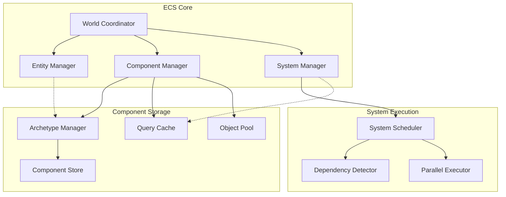

### Component Type Hierarchy

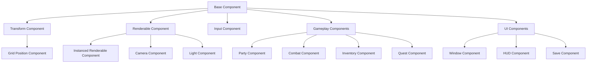

---

## System Architecture

### System Dependency Graph

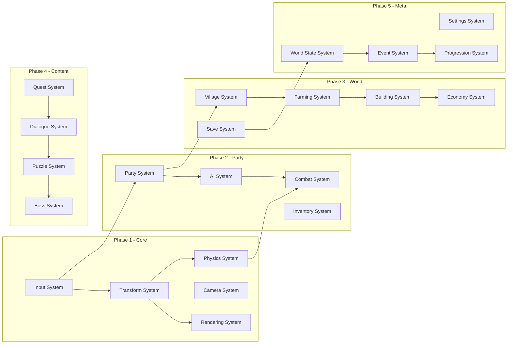

### Rendering Pipeline

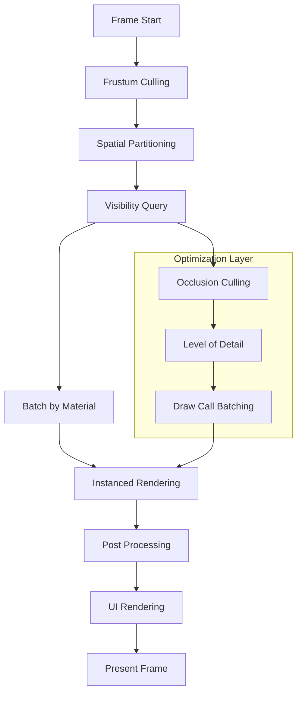

---

## Core Systems Documentation

### Phase 1: Foundation Systems (Week 1-2)

#### 1. Core ECS Framework
```javascript
class ArchetypeECS {
    // Archetype-based storage for cache efficiency
    archetypes = new Map(); // Component signature -> entities
    componentStores = new Map(); // Component type -> dense array
    entityToArchetype = new Map(); // Entity -> archetype mapping
    
    query(components) {
        const signature = this.getSignature(components);
        return this.archetypes.get(signature) || [];
    }
    
    addComponent(entity, component) {
        // O(1) operation with archetype migration
        this.migrateEntity(entity, component);
    }
}
```

**Performance Targets:**
- Entity creation: <0.1ms per entity
- Component queries: <0.01ms for 10,000 entities
- Memory usage: <1MB per 1000 entities

#### 2. Transform System
```javascript
class TransformSystem extends System {
    components = ['TransformComponent'];
    
    update(deltaTime) {
        const transforms = this.query(['TransformComponent']);
        
        // SIMD-friendly batch updates
        for (const entity of transforms) {
            const transform = entity.getComponent('TransformComponent');
            if (transform.isDirty) {
                this.updateMatrix(transform);
                transform.markClean();
            }
        }
    }
}
```

**Features:**
- Dirty flag optimization
- Matrix caching
- Hierarchical transforms
- Spatial indexing integration

#### 3. Rendering System
```javascript
class RenderingSystem extends System {
    components = ['RenderableComponent', 'TransformComponent'];
    instancedMeshes = new Map();
    octree = new Octree();
    
    update() {
        const renderables = this.frustumCull();
        const batches = this.batchByMaterial(renderables);
        
        for (const batch of batches) {
            this.renderInstanced(batch);
        }
    }
}
```

**Optimizations:**
- Frustum culling with octree
- GPU instancing for similar objects
- Material batching
- LOD system integration

#### 4. Input System
```javascript
class InputSystem extends System {
    commandQueue = [];
    inputMap = new Map();
    
    update() {
        this.processInputs();
        this.dispatchCommands();
        this.clearQueue();
    }
    
    // Command pattern for undo/redo
    executeCommand(command) {
        command.execute();
        this.commandHistory.push(command);
    }
}
```

**Features:**
- Command pattern for actions
- Input mapping and rebinding
- Multi-device support
- Input buffering

#### 5. Camera System
```javascript
class CameraSystem extends System {
    components = ['CameraComponent', 'TransformComponent'];
    
    update(deltaTime) {
        const cameras = this.query(['CameraComponent']);
        
        for (const entity of cameras) {
            const camera = entity.getComponent('CameraComponent');
            const transform = entity.getComponent('TransformComponent');
            
            this.updateProjection(camera);
            this.updateViewMatrix(camera, transform);
            this.smoothFollow(camera, deltaTime);
        }
    }
}
```

**Features:**
- Isometric and orthographic projection
- Smooth camera following
- Zoom interpolation
- Multiple camera support

### Phase 2: Party & Character Systems (Week 3-4)

#### 6. Party System
```javascript
class PartySystem extends System {
    components = ['PartyComponent'];
    maxPartySize = 3;
    
    switchToMember(partyEntity, memberIndex) {
        const party = partyEntity.getComponent('PartyComponent');
        if (memberIndex < party.members.length) {
            party.activeLeader = memberIndex;
            this.updateCameraTarget(party.members[memberIndex]);
        }
    }
}
```

**Features:**
- Dynamic party composition
- Leader switching
- Member coordination
- Formation management

#### 7. AI System
```javascript
class AISystem extends System {
    components = ['AIComponent', 'TransformComponent'];
    behaviorTrees = new Map();
    
    update(deltaTime) {
        const aiEntities = this.query(['AIComponent']);
        
        for (const entity of aiEntities) {
            const ai = entity.getComponent('AIComponent');
            const behaviorTree = this.behaviorTrees.get(ai.behaviorType);
            behaviorTree.tick(entity, deltaTime);
        }
    }
}
```

**Features:**
- Behavior tree AI
- State machines
- Pathfinding integration
- Group behaviors

#### 8. Combat System
```javascript
class CombatSystem extends System {
    components = ['CombatComponent', 'TransformComponent'];
    
    update(deltaTime) {
        this.processAttacks();
        this.updateCooldowns(deltaTime);
        this.checkCollisions();
        this.applyDamage();
    }
    
    executeAttack(attacker, target) {
        // Real-time combat calculations
        const damage = this.calculateDamage(attacker, target);
        this.applyDamage(target, damage);
        this.triggerEffects(attacker, target);
    }
}
```

**Features:**
- Real-time action combat
- Weapon system integration
- Status effects
- Boss mechanics support

### Phase 3: World Building Systems (Week 5-6)

#### 9. Village System
```javascript
class VillageSystem extends System {
    components = ['VillageComponent'];
    
    update(deltaTime) {
        const villages = this.query(['VillageComponent']);
        
        for (const entity of villages) {
            const village = entity.getComponent('VillageComponent');
            this.updatePopulation(village, deltaTime);
            this.calculateMorale(village);
            this.processProduction(village, deltaTime);
        }
    }
}
```

**Features:**
- Population simulation
- Morale calculation
- Resource production
- Building management

#### 10. Building System
```javascript
class BuildingSystem extends System {
    components = ['BuildingComponent', 'TransformComponent'];
    
    placeBuilding(buildingType, position) {
        if (this.canPlace(buildingType, position)) {
            const entity = this.createBuilding(buildingType, position);
            this.updateVillageStats(entity);
            return entity;
        }
        return null;
    }
}
```

**Features:**
- Placement validation
- Resource requirements
- Construction progression
- Upgrade system

### Phase 4: Content Systems (Week 7-8)

#### 11. Quest System
```javascript
class QuestSystem extends System {
    components = ['QuestComponent'];
    questGraph = new DependencyGraph();
    
    update() {
        const activeQuests = this.query(['QuestComponent']);
        
        for (const entity of activeQuests) {
            const quest = entity.getComponent('QuestComponent');
            this.checkObjectives(quest);
            this.updateProgress(quest);
            
            if (quest.isComplete()) {
                this.completeQuest(quest);
                this.unlockFollowupQuests(quest);
            }
        }
    }
}
```

**Features:**
- Objective tracking
- Quest dependencies
- Dynamic generation
- Reward distribution

#### 12. Save System
```javascript
class SaveSystem extends System {
    async saveGame(filename) {
        const gameState = {
            entities: this.serializeEntities(),
            world: this.serializeWorld(),
            progress: this.serializeProgress(),
            settings: this.serializeSettings()
        };
        
        const compressed = await this.compress(gameState);
        await this.writeToFile(filename, compressed);
    }
    
    async loadGame(filename) {
        const compressed = await this.readFromFile(filename);
        const gameState = await this.decompress(compressed);
        this.restoreGameState(gameState);
    }
}
```

**Features:**
- Delta compression
- Validation and recovery
- Multiple save slots
- Cloud sync support

---

## Implementation Timeline

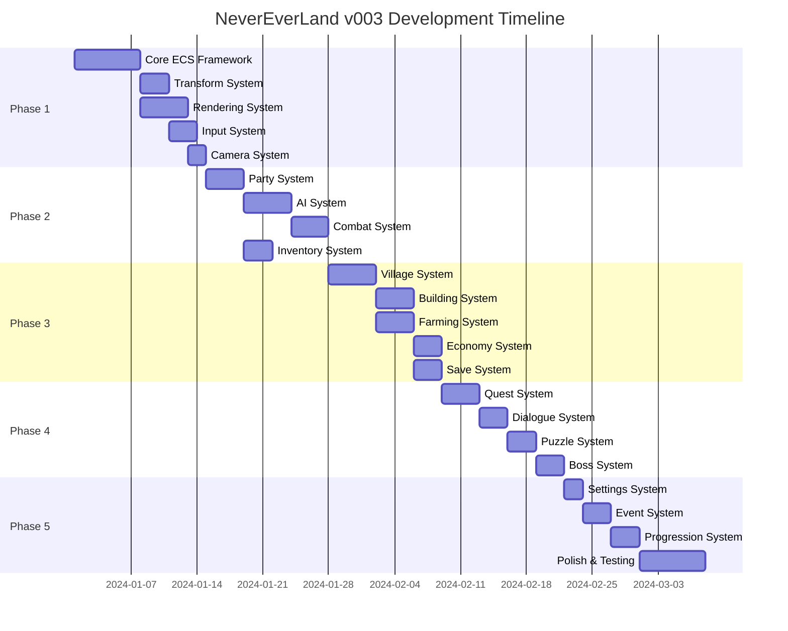

---

## Performance Optimization Strategies

### Memory Management

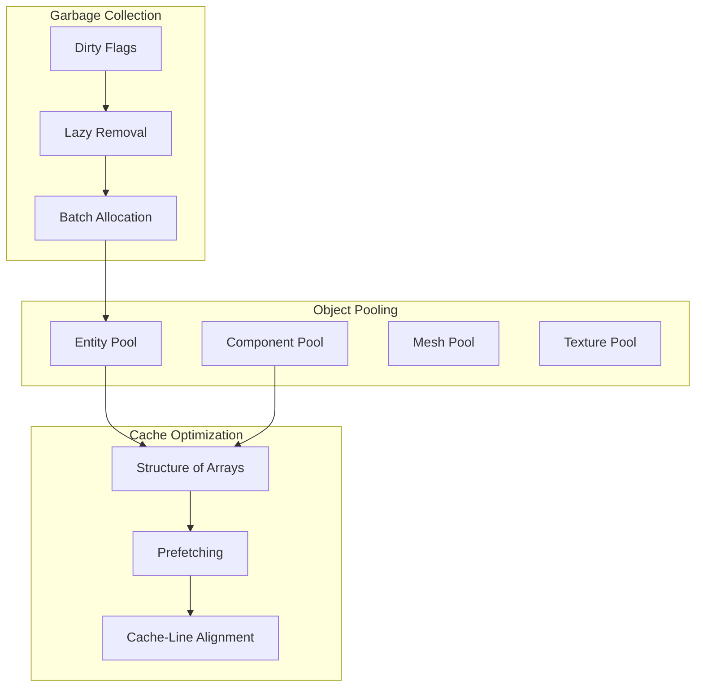

### Rendering Optimization

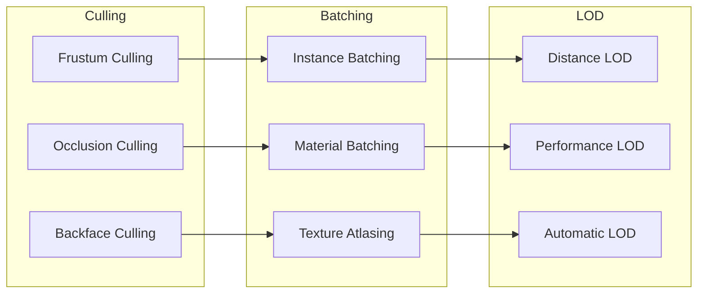

### Data Flow Optimization

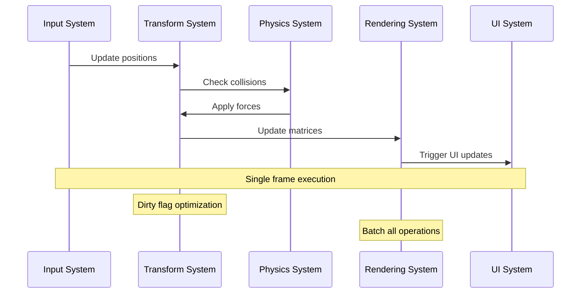

---

## Testing Framework

### Automated Testing Pipeline

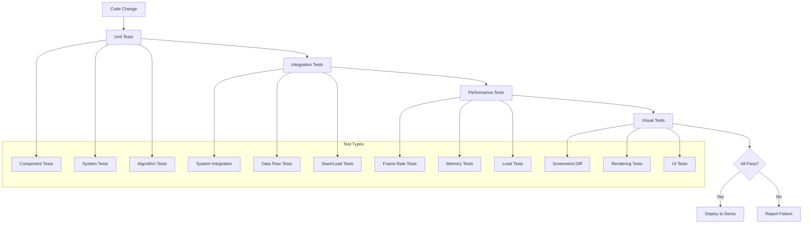

### Demo Scene Structure

```
demos/
├── core-ecs-demo/          # ECS performance and functionality
│   ├── entity-stress-test.js
│   ├── component-query-test.js
│   └── system-performance-test.js
├── rendering-demo/         # Graphics and optimization
│   ├── instancing-test.js
│   ├── culling-test.js
│   └── lod-test.js
├── party-demo/            # Character and party systems
│   ├── character-switching.js
│   ├── ai-behavior.js
│   └── party-coordination.js
├── village-demo/          # Building and management
│   ├── construction-test.js
│   ├── resource-flow.js
│   └── population-sim.js
├── combat-demo/           # Action and combat
│   ├── real-time-combat.js
│   ├── boss-mechanics.js
│   └── party-combat.js
└── integration-demo/      # Full game systems
    ├── complete-gameplay.js
    ├── save-load-test.js
    └── performance-benchmark.js
```

---

## Development Tools Architecture

### Live Development Environment

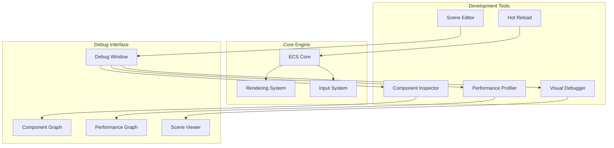

### Performance Monitoring

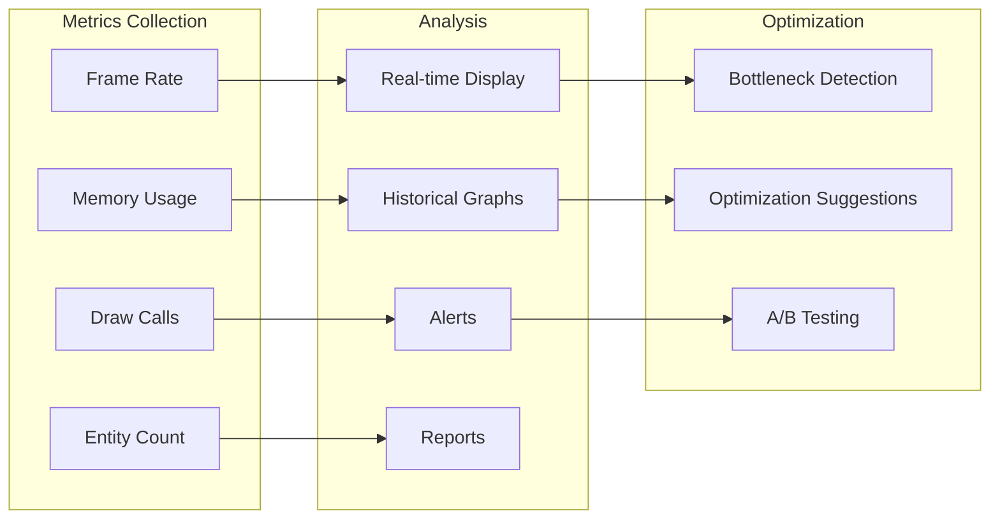

---

## Technical Specifications

### Performance Targets
- **Frame Rate**: Stable 60 FPS with 10,000+ entities
- **Memory**: <1MB per 1000 entities
- **Load Time**: <100ms for scene transitions
- **System Update**: <1ms for core systems
- **Hot Reload**: <500ms for code changes

### Platform Support
- **Primary**: Web browsers with WebGL 2.0
- **Secondary**: Node.js for headless testing
- **Future**: WebGPU support for advanced features

### Browser Compatibility
- Chrome 80+, Firefox 75+, Safari 14+, Edge 80+
- WebGL 2.0 required
- ES2020 modules support
- Optional: WebAssembly for performance-critical code

---

## Conclusion

This modular ECS architecture provides a solid foundation for the ambitious NeverEverLand RPG while maintaining development velocity through hot reload, comprehensive testing, and state-of-the-art optimization techniques. The phased approach ensures playable prototypes at each milestone, enabling continuous iteration and refinement.

The architecture is designed to scale from simple demos to the full game experience, with each system independently testable and optimizable. Performance is prioritized from day one with modern algorithms and GPU-accelerated rendering techniques.